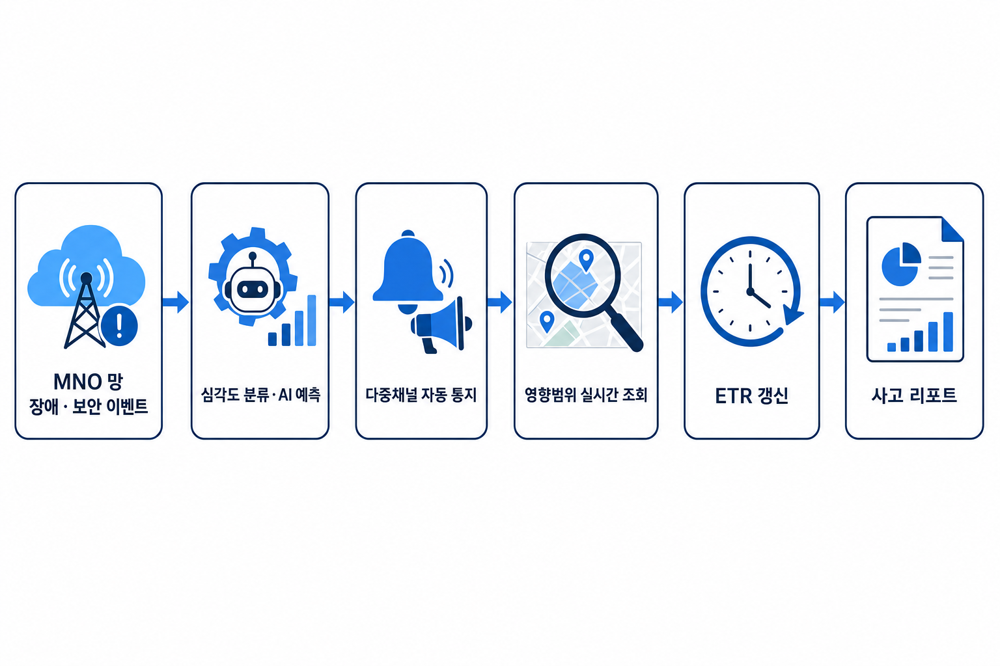
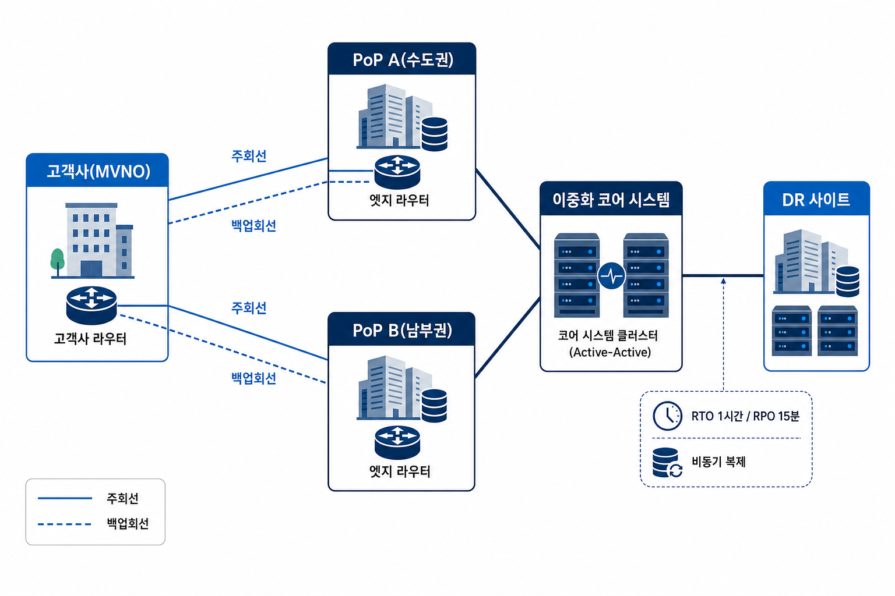

# MVNO향 통신 장애·보안사고 실시간 통지 및 영향범위 조회 시스템 구축 제안서

> 본 제안은 RFP 요구ID 16건(REQ-BIZ 6·REQ-TEC 6·REQ-OPS 4) 전 건에 회답하며, 통지·조회·ETR·리포트·AI 응대의  
> 다섯 기능이 하나의 인과 사슬로 작동하는 솔루션을 제시함. 상세견적·RFP 대조표·HW/SW 구성도·네트워크 구성  
> 상세는 별지 5종으로 분리하여 본체는 의사결정에 필요한 결론 위주로 구성함(2독자 원칙).

---

## 0. 인사말 및 제안 개요

귀사가 추진하는 「MVNO향 통신 장애·보안사고 실시간 통지 및 영향범위 조회 시스템」 구축 사업에 제안할 기회를  
주신 데 감사드림. 본 제안서는 귀사 RFP의 취지 — "MNO 사고에도 가입자를 가장 먼저 안심시키는 통신사"로  
전환하는 것 — 를 출발점으로 삼음.

### 목차

1. 통신 코어망·이중화·AI 실적으로 본 사업을 즉시 수행 가능함  
   1.1 통신 코어망·DR·24x365 운영·AI 4대 역량으로 RFP 요구를 소화함  
   1.2 DR 이중화·MVNO 공동대응 실적이 본 제안의 설계 근거가 됨  
   1.3 MNO 사고에도 가입자를 가장 먼저 안심시키는 통신사로 전환시킴  
   1.4 RFP 16건 요구 전 건에 회답하며 범위를 8개 In-scope 항목으로 확정함  
2. 장애 인지부터 리포트까지 하나의 인과 사슬로 5분 내 대응함  
   2.1 인지 → 통지 → 조회 → 리포트 6단계 흐름으로 5분 내 대응을 실현함  
   2.2 회선·PoP·코어 다중 이중화와 DR로 가용성 99.95%를 확보함  
   2.3 통지·조회·ETR·리포트·AI 5개 기능이 사고 이벤트를 축으로 연계됨  
   2.4 성능·용량·가용성·보안 4대 비기능 목표를 근거 수치로 충족함  
   2.5 검증된 연동 규격(OAuth 2.0·TLS 1.2 이상)으로 MNO와 안전하게 연결함  
3. 통지·응대 시간 단축과 근거 표기된 투자 대비 효과를 제공함  
   3.1 인지 ~ 통지 5분·조회 P99 3초로 응대 리드타임을 실질 제거함  
   3.2 AI 응대 지원으로 고객센터 문의량을 약 30% 낮춤  
   3.3 3영업일 재발방지 리포트로 사후 신뢰를 회복함  
   3.4 예산 상한 이내에서 NRC·MRC·TCO 전 지표를 충족함  
4. 쌍방 체제와 역산 스케줄로 컷오버 리스크를 사전 제거함  
   4.1 유저·벤더 쌍방 PM과 공동대응 사무국으로 24x365 대응 공백을 없앰  
   4.2 DR·MNO 리드타임을 선행 착수해 컷오버 전 실증을 완료함  
   4.3 AI 3대 기능을 사전 합의된 성공기준으로 검증함  
   4.4 시점 분리 교육과 3단계 지식이전으로 안정화 공백을 없앰  
5. 기술·외부종속·SLA 리스크를 사전 정의된 절차로 통제함  
   5.1 AI 표본 부족·통지 지연 리스크를 룰 폴백·능동 헬스체크로 차단함  
   5.2 MNO 데이터 종속 리스크를 면책조건과 관찰지표로 명확히 분리함  
   5.3 가용성·통지 SLA를 등급형 서비스크레딧으로 책임 한정함  
   5.4 전제조건·요망사항과 별지 5종으로 2독자 원칙을 완성함  
붙임. RFP 요구ID 커버리지 대사표

---

# 1. 통신 코어망·이중화·AI 실적으로 본 사업을 즉시 수행 가능함

당사는 통신사향 B2B 인프라·플랫폼 구축 전문 솔루션 벤더로서, 아래 4대 역량을 근거로 본 RFP가 요구하는  
통지·조회·이중화·AI 응대 전 영역을 즉시 수행 가능함. 이하 §1.1 ~ 1.4에서 역량·실적·취지·범위 순으로 근거를  
제시함.

## 1.1 통신 코어망·DR·24x365 운영·AI 4대 역량으로 RFP 요구를 소화함

당사는 아래 4대 역량을 핵심 경쟁력으로 보유함(근거 없는 수치·실적은 **(가상 예시)**로 명시 표기함).

- **통신 코어망·MNO 연동 전문성**: MNO·MVNO 간 Webhook/API 연동, OAuth 2.0·TLS 1.2 이상 전송보안,  
  전용선/VPN 기반 망 연동 구축 경험을 보유하여 본 RFP의 MNO 연동 규격(REQ-TEC-04·06) 요구를  
  기술적으로 소화 가능함.  
- **이중화·재해복구(DR) 설계 역량**: 네트워크·DB·DNS 다계층 이중화, 웜스탠바이·비동기 복제 기반  
  DR 설계 경험을 보유하여 가용성 99.95%/월 수준의 인프라 요구에 대응 가능함.  
- **24x365 운영체계 운영 역량**: NOC 상시 관제·공동대응 핫라인·정기 합동훈련 등 통신사와의 공동  
  운영체계를 실제 운영한 경험을 보유함.  
- **AI 응용 서비스 구축 역량**: 예측·생성형 AI를 룰 폴백·HITL(사람 검수) 게이트와 병행 설계하는  
  방법론을 보유하여, 과대약속 없는 참고형 AI 기능 구현이 가능함.

이상 4개 역량은 좋은 제안서 4조건(빠짐없이·중복없이·적게·알기쉽게) 중 요구 이상의 부가가치·매력 가격의  
전제가 되는 수행역량·신뢰성 배점에 대응함.

---

## 1.2 DR 이중화·MVNO 공동대응 실적이 본 제안의 설계 근거가 됨

아래 실적(**가상 예시**, 실제 수행 여부와 무관하게 작성함)은 본 제안 이중화 인프라(§2.2)와 공동대응  
운영체계(§4.1) 설계의 근거가 됨.

- **(가상 예시) A통신사 재해복구(DR) 이중화 구축 사업**: A통신사 대상 코어 시스템의 네트워크·DB·  
  DNS 다계층 이중화 및 웜스탠바이 DR 환경을 구축함. RTO/RPO 목표치 충족을 위한 비동기 복제 구성과  
  정기 DR 전환 훈련 체계를 함께 수립함(REQ-TEC-06 대응 역량 근거).  
- **(가상 예시) B통신사·MVNO 공동대응 핫라인 운영 사업**: B통신사와 협력 MVNO 간 24x365 공동대응  
  핫라인 및 분기 1회 합동 모의훈련 체계를 구축·운영함. 사고 발생 시 양측 담당자 동시 알림·에스컬  
  레이션 절차를 표준화함(REQ-OPS-03 대응 역량 근거).

---

## 1.3 MNO 사고에도 가입자를 가장 먼저 안심시키는 통신사로 전환시킴

가입자가 뉴스·SNS로 장애를 먼저 접하고 3주 뒤에야 보상 안내를 받던 방식(2018 국사화재 선례)에서,  
귀사가 가입자보다 먼저 인지하고 먼저 안내하는 방식으로 전환하는 것이 본 제안의 취지임.

**특징 3개(feature → benefit)**

1. **심각도별 자동 통지·다중채널 이중화 전송(REQ-BIZ-01·REQ-TEC-01·03)**  
   → 인지 ~ 담당자 도달을 40분에서 5분 이내로 단축하여, MNO 정보 종속에서 벗어나 담당자가 가장  
   먼저 상황을 인지함.  
2. **영향범위 실시간 조회·ETR 15분 주기 갱신(REQ-BIZ-02·03·REQ-TEC-02)**  
   → 영향 가입자 규모·지역·서비스를 수작업 추정 없이 P99 3초 내 확인하고, 복구 진행 상황을  
   지속 안내하여 문의 폭주를 완화함.  
3. **사고 리포트 자동생성·AI 응대 지원(REQ-BIZ-04·05a·05b)**  
   → 사고 종료 후 3영업일 이내 재발방지 리포트로 사후 신뢰를 회복하고, AI 응대 스크립트 초안  
   (HITL 검수)으로 상담사 부담을 경감함.

본 제안은 RFP 필수요구 중 REQ-BIZ-01 ~ 04(통지·조회·ETR갱신·리포트) 전 건을 충족(Y 4/4)하며, 요구ID  
16건 전체에 대한 회답은 붙임 「RFP 요구ID 커버리지 대사표」를 참조함.

---

## 1.4 RFP 16건 요구 전 건에 회답하며 범위를 8개 In-scope 항목으로 확정함

본 제안은 RFP 요구ID 16건(REQ-BIZ 6·REQ-TEC 6·REQ-OPS 4) 전부에 회답하며, 범위 외 항목은 시스템화  
대상에서 제외하여 인식 차이를 억제함.

| 구분 | 항목 |  
|---|---|  
| **In-scope(제안 대상)** | ① 심각도별 자동 통지(다중채널 이중화) ② 영향범위 실시간 조회(집계·범위 단위) |  
| | ③ 복구정보(ETR) 15분 주기 갱신 ④ 사고 이력·재발방지 리포트 자동생성 |  
| | ⑤ AI 영향범위 예측·응대 스크립트 초안(룰 폴백·HITL 병행) ⑥ MNO 연동(전용선/VPN·인증·전송보안) |  
| | ⑦ 가용성·이중화·DR 인프라 ⑧ 24x365 공동대응 운영·월간 운영 리포트 |  
| | ⑨ 통지 SLA 준수율 모니터링(월 98%, 크레딧 근거) |  
| **Out-of-scope(제안 대상 제외)** | ① MNO 망 자체의 물리적 복구(관찰 지표만 제공, 벤더 SLA 제외) |  
| | ② 가입자 개인 식별정보 원문 제공(집계·범위 단위만 제공) |  
| | ③ AI 결과의 무검수 자동 확정·발송(HITL 검수 필수) |  
| | ④ 이중화 아키텍처·배포형태의 고정(가용성 목표 전제로 벤더 제안에 위임) |

Out-of-scope 항목은 사양변경(CR) 관리의 사전 근거로 특기사항(§5.4)에서 재확인함. 상세 범위·가정·제약은  
별지 「RFP 대조표」를 참조함.

> §1에서 정의한 8개 In-scope 항목을 아래 §2에서 5개 기능 아키텍처로 구현함.

---

# 2. 장애 인지부터 리포트까지 하나의 인과 사슬로 5분 내 대응함

본 제안 솔루션은 MNO 장애·보안 이벤트 수신부터 사고 리포트 발행까지 하나의 인과 사슬로 작동함. 개념도·  
네트워크구성도는 본체에 두고, HW/SW 상세는 별지(§5.4.3 필수 별지 5종)로 분리함(2독자 원칙).

## 2.1 인지 → 통지 → 조회 → 리포트 6단계 흐름으로 5분 내 대응을 실현함

아래 개념도는 경영자용 1장으로, 좌 → 우 6단계 업무 흐름을 표현함(박스 6개, 제품명·프로토콜 배제).

| 단계 | 업무 흐름 | 근거 REQ-ID |  
|------|-----------|-------------|  
| ① MNO 망 장애·보안 이벤트 | MNO로부터 이벤트 수신(인지 시점 기준) | REQ-BIZ-01 |  
| ② 심각도 분류·AI 예측 | 긴급/높음/보통 자동 분류, AI 영향예측(참고용·룰 폴백) | REQ-BIZ-01, REQ-BIZ-05a |  
| ③ 다중채널 자동 통지 | 심각도별 담당자 통지, 인지 ~ 담당자 도달 5분 이내(종단) | REQ-BIZ-01 |  
| ④ 영향범위 실시간 조회 | 가입자 규모·지역·서비스 범위 조회(P99 3초) | REQ-BIZ-02 |  
| ⑤ ETR 갱신 | 복구 진행률·예상 복구시각 15분 주기 갱신 | REQ-BIZ-03 |  
| ⑥ 사고 리포트 | 종료 후 3영업일 이내 이력·재발방지 리포트 | REQ-BIZ-04 |

다섯 기능(통지·조회·ETR·AI응대·리포트)의 인과 고리가 끊기면 "가장 먼저 안심시키는 사업자" 약속이  
구호에 그침 — 본 개념도는 이 인과 사슬을 경영진에게 30초 내 전달함을 목적으로 함. AI 응대지원  
(REQ-BIZ-05b)은 ③ 통지 이후 고객센터 트랙으로 병행 제공되며 상세는 §2.3을 참조함.

---

## 2.2 회선·PoP·코어 다중 이중화와 DR로 가용성 99.95%를 확보함

회선·PoP·코어 시스템의 3중 이중화와 DR(재해복구) 구성으로 REQ-TEC-06·REQ-OPS-01이 요구하는 가용성  
99.95%/월을 확보함.

- **회선 이중화**: 고객사(MVNO) ~ PoP 간 주회선(전용선)·백업회선(VPN 등)을 이원 구성함. 단일 경로 절단이  
  통지·조회 서비스 중단으로 전이되지 않도록 함.  
- **PoP 이중화(dual-homing)**: 고객사 사이트를 수도권 PoP A·남부권 PoP B 양쪽에 동시 연결하는 삼각형  
  구도로 구성하여 한쪽 PoP 장애 시 잔여 PoP로 서비스를 지속함.  
- **코어 시스템 이중화**: 양 PoP에서 수렴하는 코어 시스템 클러스터는 Active-Active로 구성하여 단일  
  컴포넌트 장애가 서비스 가용성 99.95%/월(NFR-A01) 목표를 침해하지 않게 함.  
- **DR(재해복구)**: 코어 시스템과 별도 지역의 DR 사이트 간 비동기 복제를 구성하며, **DR RTO 1시간 /  
  RPO 15분**(NFR-A04)을 목표로 함. 웜스탠바이 구성·DR 전환 훈련으로 검증함. 재해 선언 구간·계획된  
  DR 전환 훈련 구간은 월 가용성(NFR-A01) 집계에서 제외하고 DR RTO/RPO 미달은 별도 DR SLA로  
  판정함(동일 사유 이중 페널티 배제).  
- **채널 자동 전환**: 통지 채널(API·이메일·SMS) 다중화로 단일 채널 장애 시 30초 이내 대체 채널로  
  자동 전환함(NFR-A02, REQ-TEC-03). 채널 헬스체크 + 페일오버 오케스트레이션으로 실현하며, 수동  
  타임아웃형 페일오버는 배제함.

이중화 방식(Active-Active/Standby 세부 구성)·배포형태는 벤더 제안(본 제안)에 위임되며, 상세 구성은  
별지 「HW 구성도」·「네트워크 구성 상세」(§5.4.3)를 참조함.

---

## 2.3 통지·조회·ETR·리포트·AI 5개 기능이 사고 이벤트를 축으로 연계됨

5개 기능 도메인을 독립 컴포넌트로 구성하되 사고 이벤트를 공통 축으로 연계하여 REQ-BIZ-01 ~ 05b·  
REQ-TEC-01·03·05를 충족함.

| 기능 도메인 | 구성 요소 | 근거 REQ-ID | 핵심 설계 포인트 |  
|-------------|-----------|-------------|-------------------|  
| 통지 | 심각도 규칙엔진 + 다중채널 발송기 | REQ-BIZ-01, REQ-TEC-01·03 | 능동 헬스체크 기반 장애 감지 + 병렬/우선순위 채널 전송으로 수신 ~ 통지 1분(NFR-P01) 충족, 채널 전환 30초(NFR-A02)가 1분 예산을 침범하지 않게 설계 |  
| 조회 | 영향범위 조회 API + 사전집계 뷰 | REQ-BIZ-02, REQ-TEC-02 | CQRS 읽기 최적화·사전집계·캐시(TTL ≤ 5초)로 피크 300 TPS에서 평균 2초 & P99 3초(NFR-P03) 동시 충족 |  
| ETR | 복구정보 갱신 파이프라인 | REQ-BIZ-03 | MNO 복구정보 수신 → 15분 주기 갱신·완료까지 연속 조회 제공, MNO 미제공 기인 미갱신은 크레딧 면책 |  
| 리포트 | 리포트 자동생성기(사고/월간) | REQ-BIZ-04, REQ-OPS-04 | 통지 타임라인·영향범위·MTTR 집계 → 사고 종료 후 3영업일 리포트, 월간 운영 리포트(통지 소요·MNO MTTR 관찰·재발률) |  
| AI | AI 예측 엔진 + AI 응대 스크립트 생성기 | REQ-BIZ-05a·05b, REQ-TEC-05 | 참고용·HITL 검수 필수, 표본 부족 시 룰 폴백 병행, 추론 3초 이내, 백테스트 오차율 ±15% 이내 합격 집계, 신규 사고 누적 10건 시 재학습 |

AI 예측·응대는 상담사(HITL) 검수 게이트를 통과해야 발송·활용 가능함 — 이로써 "응대 부담 경감"과  
"정확성" 상충을 조정하고 과대약속을 배제함. 조회 기능은 자사 가입자 분포(사전집계 뷰)와 MNO 장애  
영향 정보(Webhook 수신분)를 지역·망 식별자·서비스 구분 키로 조인하여 산출하며, 조인 결과는 집계·범위  
단위로만 노출함(개인정보 최소화). 24x365 공동대응 핫라인(FR-운영-01, REQ-OPS-03)은 위 5개 기능 도메인의  
운영 주체로서 상시 연계되며 상세는 §4.1을 참조함.

---

## 2.4 성능·용량·가용성·보안 4대 비기능 목표를 근거 수치로 충족함

성능(P)·용량(C)·가용성(A)·보안(S) 4대 필수 항목을 각각 대응 설계로 충족함.

### 성능(P)

- **NFR-P01·P02(REQ-TEC-01)**: 수신 ~ 통지 1분 이내, 전송 성공률 99.9% 이상(월, 정상·피크 포함). 능동  
  헬스체크 + 병렬/우선순위 채널 전송으로 실현함.  
- **NFR-P03(REQ-TEC-02)**: 영향범위 조회 평균 2초 & P99 3초(피크 300 TPS 동시 충족). CQRS 읽기  
  최적화·사전집계·캐시 신선도(TTL ≤ 5초) 관리로 정확성과 성능을 양립함.

### 용량(C)

- **NFR-C01(REQ-TEC-02)**: 동시 조회 처리량 300 TPS 이상, NFR-P03과 동일 부하시험으로 검증함.  
- **NFR-C02(REQ-TEC-06)**: 통지 담당자 500 계정 이상(개통 1년차 기준) 지원, 계정 증가에도 NFR-P01  
  통지 예산 내 팬아웃 성능을 유지함.  
- **NFR-C03(REQ-TEC-06·REQ-TEC-04)**: 통지 이력 3년 이상 보관, 위변조 방지 로그(NFR-S02)로 무결성을  
  유지함.

### 가용성(A)

- **NFR-A01(REQ-OPS-01)**: **서비스 가용성 99.95%/월(월 허용 다운타임 약 21.6분)**을 이중화 전제로  
  달성함. 벤더 SLA 대상 가용성 지표는 본 1종으로 한정함.  
- **NFR-A02(REQ-TEC-03)**: 단일 채널 장애 시 대체 채널 자동 전환 30초 이내(채널 헬스체크 + 페일오버  
  오케스트레이션).  
- **NFR-A03(REQ-TEC-06)**: 무중단 Scale-out 지원, 노드 증설 시 서비스 중단 없이 용량 확장함.  
- **NFR-A04(REQ-TEC-06)**: DR RTO 1시간 / RPO 15분, 웜스탠바이·비동기 복제로 구현하며 DR 전환 훈련으로  
  검증함. 재해 선언·DR 훈련 구간은 NFR-A01 월 가용성 집계에서 별도 제외함(가용성-DR 예산 충돌 해소).

### 보안(S)

- **NFR-S01(REQ-TEC-04)**: API 접근 OAuth 2.0(서버 간 연동은 client credentials), 전송구간 TLS 1.2  
  이상(신규 구축 TLS 1.3 권장). 접근권한은 관리자/운영자/조회자 3단계 최소권한으로 분리함.  
- **NFR-S02(REQ-TEC-04)**: 통지 이력은 위변조 방지 로그(해시체인·전자서명·WORM 등)로 보관하고, 로그  
  재계산 해시 대사로 무결성 검증 100% 통과를 목표로 함.

HW/SW 상세 스펙, 부하시험·DR 훈련 절차서는 별지 「HW 구성도」·「SW 구성도」를 참조함(2독자 원칙).

---

## 2.5 검증된 연동 규격(OAuth 2.0·TLS 1.2 이상)으로 MNO와 안전하게 연결함

REQ-TEC-04가 요구하는 MNO 연동 규격을 아래와 같이 확정함.

- **Webhook(수신)**: MNO → 시스템 이벤트 푸시. 인증 **OAuth 2.0**, 페이로드 스키마(이벤트ID·수신시각·  
  심각도·사고유형·영향 원천), 재전송·중복 제거·서명 검증을 포함함.  
- **API(조회)**: 영향범위·복구정보·통지이력 조회. 인증 **OAuth 2.0**, 전송보안 **TLS 1.2 이상**(TLS 1.3  
  권장), 요청/응답 스키마·오류 코드·응답시간 목표(조회 P99 3초, NFR-P03)를 규정함.  
- **무결성 로그**: 통지 이력은 해시체인·전자서명·WORM 등 위변조 방지 로그로 보관하고, 로그 재계산 해시  
  대사로 무결성을 검증함(NFR-S02, NFR-C03과 연계하여 사후 SLA·감사 증거의 신뢰성을 보장).  
- **시각 정합성**: "발생/수신" 시각 기준은 MNO 이벤트(Webhook) 수신 시각으로 정렬하고, 통지 SLA(수신 ~  
  통지 1분) 자동 측정을 위해 시각 동기(NTP 등)를 연동 규격에 포함함.  
- **접근권한**: 관리자/운영자/조회자 3단계 분리·최소권한 적용(NFR-S01).

HW/SW 상세(연동 장비 스펙, 방화벽 정책, 상세 API 명세서)는 별지 「RFP 대조표」·「HW 구성도」·  
「SW 구성도」를 참조함. 본체는 연동 규격의 원칙만 서술함(2독자 원칙).

> §2에서 정의한 아키텍처가 실제로 만들어내는 시간 단축·비용 절감 효과를 §3에서 정량적으로 제시함.

---

# 3. 통지·응대 시간 단축과 근거 표기된 투자 대비 효과를 제공함

본 제안은 인지 ~ 통지 5분·조회 P99 3초의 정량 효과, AI 응대 지원에 따른 비용 절감, 재발방지 리포트를  
통한 리스크 회피 효과, 예산 상한 이내의 투자 대비 효과를 아래 순서로 제시함. 모든 수치는 (실측) ·  
(실측 기준) · (레퍼런스 기반 예상치) · (예상치) 중 하나로 근거를 표기함(모호어 금지).

- (실측): RFP As-Is 현황 수치, 과거 실사례(2018 국사화재)  
- (실측 기준): 인수기준의 판정 방법이 타임스탬프·산출물 제출시각 등 확정적 측정 방식인 목표값  
  (PoC·부하시험으로 계약 전 확증)  
- (레퍼런스 기반 예상치) / (예상치): 유사 사례·정황상 추정치로, 계약상 확정 수치가 아님

## 3.1 인지 ~ 통지 5분·조회 P99 3초로 응대 리드타임을 실질 제거함

기존 방식(실측, As-Is) 대비 제안 솔루션의 목표값은 인수기준에 판정 방법이 명시된 확정적 측정 지표이므로  
(실측 기준)으로 표기하며, 계약 전 통합·부하시험으로 재확인함.

| 항목 | 기존 방식 | 제안 솔루션 | 효과 |  
|------|-----------|-------------|------|  
| 장애 인지 ~ 담당자 통지 도달 | 평균 40분(실측) | 5분 이내, 종단(실측 기준, 통합·부하시험 e2e 리허설 측정) | 87.5%↓(8배 단축) |  
| 가입자 선제 안내 착수 | 수일(실측) | 30분 이내(실측 기준, 통지 로그 확인) | 수일→30분, 응대 리드타임 실질 제거 |  
| 영향범위(가입자·지역·서비스) 조회 | 수작업 사후 추정(실측) | 피크 300 TPS에서 평균 2초 & P99 3초(실측 기준, 부하시험 확증) | 수작업 제거, 사고 중 즉시 대응 근거 확보 |  
| 영향범위 표본 정확도 | 수작업 추정치(정확도 미보증, 실측) | 표본 100건 대사 100% 일치(실측 기준, 통합·부하시험 병행 표본 대사) | 오안내·과다안내 리스크 제거 |

5분(종단)과 1분(REQ-TEC-01, 시스템 전송 구간)은 상·하위 부분집합 관계이며 계약 정산 시 서로 다른  
지표로 분리 판정함 — 두 수치를 혼용해 이중 배점·이중 페널티로 오독하지 않도록 본 항목은 "5분(종단)"  
단일 헤드라인만 사용함. 위 표의 "통합·부하시험 e2e 리허설 측정"·"표본 100건 대사" 두 항목은 §4.2  
마스터스케줄의 통합·부하시험(2027-01) 단계에서 300 TPS 부하시험과 병행 실시함.

---

## 3.2 AI 응대 지원으로 고객센터 문의량을 약 30% 낮춤

AI 응대 스크립트 초안(HITL 검수)으로 상담사 응대 부담을 경감하고, 고객센터 문의량 감소에 기여함  
(REQ-BIZ-05b, 권장·부분가능).

| 항목 | 기존 방식 | 제안 솔루션 | 효과 |  
|------|-----------|-------------|------|  
| 월 고객센터 문의량 | 약 5,000건(실측, baseline) | 약 3,500건(레퍼런스 기반 예상치) | 약 30%↓ |  
| 응대 스크립트 준비 | 수기 작성(실측) | 통지 후 10분 이내 AI 초안 생성, 상담사 HITL 검수 후 사용(실측 기준, 생성·검수 로그) | 초안 작성 리드타임 실질 제거 |

월 문의 30% 감소는 확률형·기여형 지표로 분류한 수치임(결정론적 합격률 아님). 본 30% 수치는  
**(레퍼런스 기반 예상치)**로 표기하며, AI 예측·응대는 참고용·HITL 필수·룰 폴백 병행을 전제로 함  
(과대약속 금지). 문의량 감소를 인건비·아웃소싱비 절감액(원)으로 직접 환산하려면 콜당 처리원가·상담  
인력 계상 방식(자체/아웃소싱) 데이터가 필요하며, 해당 데이터가 현재 범위에 없으므로 본 제안은 문의량  
감소율까지만 제시하고 금액 환산은 발주사 원가 데이터 확보 후 별도 산정함(근거 없는 절감액을 임의  
산출하지 않음). 상세 산출식·가정치(콜당 처리원가 가정 시 절감액 산식)는 별지를 참조함.

---

## 3.3 3영업일 재발방지 리포트로 사후 신뢰를 회복함

사고 종료 후 재발방지 리포트로 사후 신뢰를 자산화함(2018 국사화재 재발 방지, REQ-BIZ-04, 필수).

| 항목 | 기존 방식 | 제안 솔루션 | 효과 |  
|------|-----------|-------------|------|  
| 사고 이력·재발방지 리포트 제공 | 사후 지연(2018 국사화재 사례 3주, 실측) | 사고 종료 후 3영업일 이내 제공(실측 기준, 산출물·제출 시각 확인) | 지연 3주 → 3영업일, 사후 신뢰 회복 리드타임 실질 단축 |

3영업일 이내 제공은 인수기준의 산출물·제출 시각 확인이라는 확정적 판정 방법에 근거하므로  
**(실측 기준)**으로 명시함(확률형 추정이 아님). 사고 후 신속·투명한 재발방지 리포트 제공은 가입자·  
상담사의 신뢰 회복에 기여하여 해지율 방어 효과가 있을 것으로 기대되나, 정량적 해지율 방어 효과(%p)는  
발주사의 가입자 기반 ARPU·과거 해지율(사고 전후 비교) 데이터가 확보되어야 산정 가능함. 해당 데이터가  
현재 범위에 없으므로 본 항목은 방향성만 **(예상치)**로 제시하고, 임의의 %p 수치를 산출하지 않음(근거  
없는 해지율 수치는 계약·영업 단계에서 과대약속 리스크로 이어짐). 상세 산출식·가정치(가입자 기반·과거  
해지율 데이터 확보 시 해지율 방어 효과 산출식)는 별지를 참조함.

---

## 3.4 예산 상한 이내에서 NRC·MRC·TCO 전 지표를 충족함

본 항목은 의사결정자용 요약이며, 상세 항목별 견적·5년 TCO 산출 내역은 별지 「견적서」로 분리함  
(2독자 원칙).

| 구분 | 이니셜(NRC) | 러닝(MRC 기준) | 5년 누계(TCO) |  
|---|---|---|---|  
| RFP 예산 상한(밴드) | 8억원 이내(실측) | 월 2,500만원 이내(실측) | 25억원 이내(실측) |  
| 제안 솔루션 견적 요약 | 약 7.4억원(예상치, 상세는 별지 「견적서」 참조) | 약 2,450만원/월(예상치, 1년차 기준) | 약 22.1억원(예상치, 5년 누계) |  
| 예산 상한 대비 여유 | 약 0.6억원(-7.5%p) | 약 50만원/월(-2%p) | 약 2.9억원(-11.6%p) |

금액은 모두 **부가세 별도**(공급가 기준)·원화 표기임. 5년 TCO 예상치는 MRC 1년차 요율을 60개월  
단순 적용한 근사치이며, **다년 MRC는 2년차부터 연 단위 요율 조정(물가연동·회선 원가 변동·라이선스  
갱신가 pass-through)을 전제**로 함 — 확정 에스컬레이션 산식·연도별 인상률은 별지 「견적서」에서  
상세 산출함. SLA 미달 시 최대 크레딧 노출액은 월 MRC 대비 At-Risk 상한 약 20% ≈ 490만원/월이며,  
상세는 §5.3을 참조함.

AI 모델 재학습·성능관리는 MRC 정액에 포함하되, 신규 사고 누적 10건 재학습 트리거를 초과하는 대량  
재학습은 실비 정산 대상으로 구분함(하자보수 1년 무상 ↔ MRC 유상 유지관리 경계와 중첩되지 않도록  
인수기준에서 분리 명문화).

> §3에서 확인한 효과·투자 규모를 실현할 수행 체제·일정을 §4에서 제시함.

---

# 4. 쌍방 체제와 역산 스케줄로 컷오버 리스크를 사전 제거함

24x365 공동대응 체제와 컷오버 역산 스케줄로 REQ-OPS-03·REQ-TEC-06이 요구하는 운영·일정 리스크를  
선제 차단함. 마스터스케줄 기준일은 킥오프 2026-09-01 · 컷오버 2027-03-02 · 안정화 2027-03월임.

## 4.1 유저·벤더 쌍방 PM과 공동대응 사무국으로 24x365 대응 공백을 없앰

### 조직 개요

- 오너(의사결정)는 유저(발주사) 임원이 맡고, 벤더는 상응 직무자를 상무급 스폰서로 임명함.  
- PM은 유저·벤더 쌍방 임명이 원칙 — 유저 PM(사업 총괄)·벤더 PM(수행 총괄)이 공동 의사결정함.  
- PL(팀장급)은 벤더가 인선까지 확정해 제안서에 성명·경력을 명시함(인선 미정 시 감점 요인).  
- 공동대응 사무국을 필수 설치하고, 역할·보고라인·보고빈도(주간 진척회의)를 사전 정의함.

### 조직도(개조식)

- 운영위원회(유저 오너 + 벤더 스폰서) — 월 1회, 주요 의사결정·이슈 에스컬레이션 승인  
  - 사무국(공동, 유저 PM + 벤더 PM 공동 운영) — 주간 진척회의 주관, 이슈·리스크 관리  
    - 개발팀(벤더 PL) — 통지·조회·ETR·리포트 기능 개발  
    - MNO 연동팀(벤더 PL) — 연동 규격·보안검토·전용선/VPN 협의(REQ-TEC-06)  
    - AI팀(벤더 PL) — 예측·응대 모델 구축·백테스트·재학습 파이프라인(REQ-BIZ-05a·05b, REQ-TEC-05)  
    - **인프라/아키텍처팀(DR·이중화 담당, 벤더 PL)** — DR 웜스탠바이 구축, DR 전환훈련 설계·실행,  
      RTO 1시간/RPO 15분(NFR-A04) 실증 및 결과 리포트(§4.2·4.4 연계)  
    - **PoC/파일럿 검증팀** — PoC 헌장 수립, 검증 실행, 결과 리포트(§4.3 연계)  
    - 이행·운영준비팀 — 교육·지식이전·런북·에스컬레이션 매트릭스 작성(§4.4 연계)  
  - 24x365 공동대응 핫라인(유저 운영팀 + 벤더 NOC, 상시 운영) — 사고 시 MNO-MVNO 공동 대응 창구  
    - 분기 1회 합동 모의훈련 주관(결과 리포트를 사무국에 제출, REQ-OPS-03)

### 역할·책임(RACI 요지)

| 구분 | 유저(발주사) | 벤더 |  
|---|---|---|  
| 요구 확정·검수 | 승인(A) | 제안·실행(R) |  
| 개발·MNO 연동·AI 구축 | 협의(C) | 실행(R) |  
| PoC/파일럿 성공기준 합의 | 합의(A) | 제안·실행(R) |  
| 24x365 핫라인 1차 대응 | 공동 실행(R) | 공동 실행(R) |  
| 운영 이관 후 정상운영 | 실행(R) | 지원(C) |

---

## 4.2 DR·MNO 리드타임을 선행 착수해 컷오버 전 실증을 완료함

컷오버(2027-03-02) 역산 시 파일럿 4주(2027-02) 확보가 최우선 제약이므로, MNO 연동 보안검토·승인  
리드타임과 DR 웜스탠바이 구축을 개발 초·중반에 선행 착수함.

### 마일스톤 일람표

| 단계 | 기간 | 주요 내용 | 역산 버퍼·비고 |  
|---|---|---|---|  
| 착수(킥오프) | 2026-09-01 | 사무국 발족, 요건정의 착수 | — |  
| 요건정의·기본설계 | 2026-09 ~ 09월말 | FR/NFR 상세설계, 인수기준 확정 | SRS 확정본 기준 |  
| MNO 연동 협의·보안검토 신청 | 2026-09 ~ 10월 초(개발 착수와 병행) | 연동 규격 협의, 보안검토·승인 신청 | 승인 리드타임이 길어 개발 초기에 선착수(REQ-TEC-06) |  
| 프로그램 개발 | 2026-09 ~ 2027-01 | 통지·조회·ETR·리포트·AI 기능 구현 | 5개월 확보 |  
| DR 웜스탠바이 구축 | 2026-10 ~ 2026-11 | 이중화·비동기 복제, RTO 1h/RPO 15m(NFR-A04) 목표 구성 | 개발 초·중반 전진 착수, 전환훈련·재훈련 버퍼 확보용으로 구축 종료를 1개월 앞당김 |  
| 1차 DR 전환훈련 및 재훈련 버퍼 | 2026-12(1차 훈련 12-01 ~ 12-15, 재훈련 버퍼 12-16 ~ 12-31) | RTO 1h/RPO 15m(NFR-A04) 실증 전환훈련, 미통과 시 12월 내 재훈련, 결과 리포트 사무국 제출 | **파일럿 착수 게이트 조건 — "DR 훈련 통과" 미충족 시 파일럿 착수 보류**. 구축 종료월과 분리해 재훈련 여유 2주 확보 |  
| 통합·부하시험 | 2027-01 | 300 TPS·P99 3초 부하시험, 통지 5분 종단 e2e 리허설, 영향범위 표본 100건 대사, 보안점검 | 시험운용 진입 전 게이트(DR 전환훈련과 시기 분리) |  
| PoC(기술검증) | 2027-01-15 ~ 01-31(2주) | AI 백테스트·기능 검증, 격리망 | 시험운용 공식 착수 전 선행 실시 |  
| 파일럿(시험운용) | 2027-02-01 ~ 02-28(4주) | 실사용자 제한범위, 실운영값 검증 | RFP 지정 시험운용 창(1개월), **착수 게이트: 1차 DR 전환훈련 통과** |  
| 컷오버 GO/NO-GO 판정 | 2027-02-25 | 파일럿 성공기준 충족 여부 판정회의 | 컷오버 D-5, 미충족 시 조건부 컷오버·보완계획 |  
| 컷오버(본가동) | 2027-03-02 | 정식 서비스 개시 | 트래픽 피크(연말연초) 회피 |  
| 안정화(하이퍼케어) | 2027-03-02 ~ 03-31(약 1개월) | 전담반 상주, SLA 모니터링(크레딧 유예) | §4.4 참조 |  
| 정상 운영 전환 | 2027-04-01(조건부) | 출구기준 충족 시 정상 전환, 크레딧 적용 개시 | §4.4 출구기준 미충족 시 연장 |

### 역산 논리

- 컷오버 기준 역산 시 파일럿 4주 확보가 최우선 제약이므로, PoC는 파일럿 착수 전인 2027-01 하반월에  
  선행 완료함.  
- MNO 연동 보안검토·승인 리드타임과 DR 웜스탠바이 구축 리드타임은 개발 단계 초·중반에 각각 병행  
  착수해, 시험운용 진입(2027-02-01) 전 완료를 목표로 버퍼를 흡수함.  
- DR 웜스탠바이 구축을 2026-11에 조기 종료하고, 2026-12를 1차 DR 전환훈련(전반)과 재훈련 버퍼(후반  
  2주)로 분리 운용하여, 통합·부하시험(2027-01)과 자원·일정이 겹치지 않게 함. 파일럿 착수 전에 DR  
  전환훈련 통과 여부를 게이트로 판정해, 실증 없는 컷오버 리스크를 GO/NO-GO(2027-02-25) 이전 단계에서  
  차단함.  
- 정밀 공수·담당자별 간트는 계약 후 착수보고 시점에 별지로 제출함(제안 단계 불확정 요소 반영).

---

## 4.3 AI 3대 기능을 사전 합의된 성공기준으로 검증함

백테스트 오차율 ±15%를 성공기준에 반영하고, 표본 부족 시 룰 폴백을 병행함(REQ-BIZ-05a·05b·REQ-TEC-05,  
권장·부분가능). 성공기준·베이스라인은 양측 사전 합의(PoC 헌장) 후 착수하며, 원자료(로그·백테스트 상세)는  
별지 「PoC 검증 결과 자료」로 분리하고 본체에는 계획·기준·결론만 둠(2독자 원칙).

| 검증 항목 | 검증 가설 | 성공기준(정량) | 베이스라인(현행) | 측정 방법 | 기간·환경 |  
|---|---|---|---|---|---|  
| AI 영향범위 예측(REQ-BIZ-05a) | 과거 유사사고 패턴 학습으로 사고 초기 대응 규모를 조기 가늠 가능 | 백테스트 오차율 ±15% 이내 건을 합격 집계, 표본 부족 시 룰 폴백 자동 전환. **최소 합격률 목표는 데이터 확보 후 PoC 헌장에서 확정(가안)** | 수기 경험적 추정(오차율 미측정, 정성 판단) | 과거 사고 이력 데이터셋 백테스트, 오차율= \|예측-실측\|/실측, ±15% 합격 여부 자동 집계 | PoC 2주·격리망(과거 사고 데이터셋 재현) |  
| AI 응대스크립트 초안(REQ-BIZ-05b) | LLM 생성+HITL 검수로 상담사 응대 준비시간 단축, 문의량 감소에 기여(참고용) | 통지 후 10분 내 초안 생성, **생성된 초안은 상담사(HITL) 검수를 전건 통과해야 사용**(검수 소요·반려율은 파일럿 기간 중 참고 지표로만 관찰) | 수기 템플릿 작성(초안 소요 수십 분, FAQ 수기 갱신) | 생성 ~ 검수완료 타임스탬프, 검수 통과/반려 로그 집계 | 파일럿 4주·마스킹 실데이터(FAQ) |  
| AI 성능 유지(재학습, REQ-TEC-05) | 신규 사고 누적 10건 재학습+분기 성능점검으로 drift 대비 추론 성능 유지 | 추론 응답 3초 이내, 재학습 후 오차율이 재학습 전 대비 개선 또는 ±15% 기준 재충족. 파일럿 기간 내 재학습 트리거(누적 10건) 미충족 시 운영 이관 후 분기 성능점검 결과로 대체 판정 | 구축 시점 초기 모델 백테스트 결과(위 예측 항목과 동일 기준선) | 추론 응답시간 로그, 재학습 전후 오차율 비교 리포트 | 파일럿 4주 + 운영 이관 후 분기 성능점검(안정화 연계) |

### 시행 원칙

- PoC(기술 검증, 위 표 1행)와 파일럿(실운영값, 위 표 2·3행)을 구분하고, 성공기준은 양측이 PoC 헌장에  
  사전 서명한 뒤 착수함(착수 후 기준 변경 금지, 신뢰 훼손 방지).  
- 성공기준·베이스라인 미달 시에도 정직하게 기술함 — "○건 충족, ○건 조건부(룰 폴백 유지)"로 회답하고,  
  과장·회피 없이 Yes/No를 명확히 함.  
- PoC/파일럿 환경은 운영망·개인정보와 분리(격리망·마스킹 데이터)하여 고객 운영 트래픽에 무영향임을  
  전제조건(§5.4)과 연계해 명시함.  
- 결과는 §3 「기대 효과」의 실증 근거(Before → After)로 연계함.

---

## 4.4 시점 분리 교육과 3단계 지식이전으로 안정화 공백을 없앰

REQ-OPS-03·04가 요구하는 교육·지식이전·안정화 체계를 아래와 같이 확정함.

### 교육(시점 분리)

| 구분 | 대상 | 시점 | 형태 | 산출물 |  
|---|---|---|---|---|  
| 엔드유저 연수 | 콜센터 상담사·상황실 운영자 | 컷오버 직전(3주 이내) | 집합 교육 + 실습 | 사용자 매뉴얼·교육용 계정 |  
| 관리자 연수 | 시스템 관리자 | 컷오버 2주 전 | 집합 1회차 | 관리자 가이드·권한 정책서 |  
| 운영요원 연수 | 유저 운영팀(1선 대응) | **안정화(하이퍼케어) 진입 전 선행** | OJT + Shadow | 운영 런북·1차 대응 절차 |

엔드유저는 너무 일찍 교육하면 내용을 잊으므로 컷오버 직전에 배치하고, 운영요원·관리자는 안정화  
진입 전에 선행 실시해 하이퍼케어 기간 중 지식 이전이 즉시 작동하도록 함.

### 지식 이전(3단계)

- Shadow(관찰) → 역할 분담(공동 수행) → 독립(인수 조직 단독 운영) 순으로 단계 인계함.  
- 완료 판정: 독립 단계에서 표본 장애 시나리오 10건을 벤더 개입 없이 런북만으로 100% 처리(오처리 0건).

### 안정화(하이퍼케어) 및 출구 기준

- 기간: 컷오버(2027-03-02) ~ 2027-03-31(약 1개월), 벤더 전담반 상주. (하이퍼케어 기간은 통상 4 ~ 12주  
  범위에서 프로젝트별로 확정하는 것이 일반 원칙이며, 본 프로젝트는 위 스케줄을 근거로 약 1개월을  
  확정 기간으로 함.)  
- 출구 기준(exit criteria): 심각도 '긴급' 이슈 0건 연속 2주 유지 + 통지 SLA 준수율 98% 이상 연속 2주  
  충족(정량 기준 충족 판정 — 기간 도래만으로 판정하지 않음). 미충족 시 하이퍼케어 기간을 연장함.  
- **SLA·크레딧 적용 시점**: 안정화 기간 중 SLA는 모니터링만 하고 서비스 크레딧은 유예하며, 위 출구  
  기준 충족일(정상 운영 전환일)부터 크레딧을 적용함. 상세 근거는 §5.3.3을 참조함(중복 회피).  
- 이관 완료 후 30/60/90일 정기 리뷰로 잔여 갭을 점검함.

### 변경관리(RFC·CAB)

- 계획 작업은 RFC(변경요청) 제출 → CAB(변경자문위원회) 승인 → 사전 통지 리드타임 → 유지보수 창(배포  
  window) → 롤백 절차 순으로 수행함.  
- 계획정비 창 구간은 가용률(REQ-OPS-01) 산정에서 제외함.

### 운영 거버넌스 사이클

- 월간 SLA 리포트(가동률·통지 소요시간·MNO 복구 MTTR 관찰지표·재발률, REQ-OPS-04) → 정기 리뷰 미팅 →  
  미달 시 시정조치·재발방지 순으로 사이클을 운영함.  
- 리포트·회의체 증빙 양식(런북·에스컬레이션 매트릭스·SLA 리포트 샘플)은 별지로 첨부함.

### DR 정기훈련

- RTO 1시간/RPO 15분 설계(구축)에 그치지 않고, **연 1 ~ 2회 정기 DR 훈련**을 실시해 복구 절차를 검증하고  
  결과 리포트를 사무국에 제출함(훈련 없는 DR의 실장애 미작동 리스크 방지).

### 공동 대응 연계

- 24x365 공동대응 핫라인(REQ-OPS-03)은 안정화 종료 이후에도 상시 운영을 지속하고, 분기 1회 합동  
  모의훈련 결과 리포트를 운영 거버넌스 사이클에 통합해 관리함.

> §4의 체제·일정으로 실현 가능성을 확보한 위에서, §5에서 남는 리스크와 대응 방안을 마지막으로 정리함.

---

# 5. 기술·외부종속·SLA 리스크를 사전 정의된 절차로 통제함

AI 성능·통지 페일오버, MNO 데이터 종속, SLA·계약 조건의 3대 리스크를 판정 절차·면책 조건·서비스크레딧  
설계로 사전 통제함.

## 5.1 AI 표본 부족·통지 지연 리스크를 룰 폴백·능동 헬스체크로 차단함

**[REQ-TEC-01·02·05, 필수 2·권장 1]**

### 5.1.1 AI 예측·응대 성능 이탈 리스크(REQ-BIZ-05a·05b, REQ-TEC-05)

- 리스크: AI 영향범위 예측은 백테스트 오차율 ±15% 이내를 합격 기준으로 하나, 과거 사고 데이터 확보량에  
  성능이 좌우되어 표본 부족 구간에서 목표 이탈 가능성 존재.  
- 대응(귀속 판정 절차 명시):  
  - 판정 주체: 발주사·당사 공동 기술 검토.  
  - 입증 책임: 당사가 재학습 로그·데이터·모니터링 결과를 제시.  
  - 판정 기한: 사고 종료 후 10영업일 이내.  
  - 판정 결과: 구현 결함 기인 시 무상 하자 처리, 정상 운영 중 데이터 특성 변화(drift) 기인 시 MRC 유상  
    재학습으로 구분.  
  - 교착 시 조정(tie-break): 공동 검토 불합의 시 제3 기술감정(중립 전문가) 결과를 따름.  
  - 기한 도과 시 처리: 판정 기한 내 미판정 시 잠정 유상 처리 후 감정 결과로 사후 정산(작업 지연 방지).  
  - 표본 부족 구간은 룰 폴백을 병행하여 결과 참고용(HITL 검수) 원칙 유지.

### 5.1.2 통지·페일오버 지연 리스크(REQ-TEC-01)

- 리스크: 수신 ~ 통지 1분 예산 대비 채널 장애 시 수동 타임아웃형 절체는 지연 초과 가능성 존재.  
- 대응: 능동 헬스체크 기반 장애 감지(수동 타임아웃형 배제) + 병렬·우선순위 다중 채널 전송으로 채널 전환을  
  1분 예산 이내로 설계. 단일 채널 장애 시 30초 이내 자동 전환.  
- 조회 성능(REQ-TEC-02) 리스크: 300 TPS 이상 동시 조회 시 평균 2초·P99 3초 목표는 CQRS 읽기 최적화·  
  사전집계·캐시 신선도 관리로 대응, 부하시험으로 사전 확증.

---

## 5.2 MNO 데이터 종속 리스크를 면책조건과 관찰지표로 명확히 분리함

**[REQ-BIZ-03·REQ-TEC-06, 필수]**

- 리스크: 통지·ETR(예상 복구시각)·영향범위의 원천 데이터가 MNO 제공에 의존하는 구조적 외생 리스크 존재.  
  당사 시스템 성능이 목표를 충족해도 MNO 데이터 적시성이 낮으면 서비스 목표 달성이 제약됨.  
- 면책 조건: ETR 15분 주기 갱신 지연이 MNO 원천 정보 미제공·지연에 기인함이 입증되는 경우, 해당 사유는  
  통지 준수율 서비스크레딧 산정에서 면책(벤더 통제 불가 사유로 분리).  
- 연동 일정 리스크: MNO 연동 보안검토·승인 리드타임이 컷오버(2027-03-02) 마스터스케줄의 지연 요인이 될 수  
  있어, 연동 협의를 선행 착수하고 마스터스케줄에 버퍼를 반영(§4.2 참조).  
- 벤더 SLA 경계: MNO 망 자체의 물리적 복구(MTTR)는 관찰 지표로 두고 당사 SLA 페널티 대상에서 제외. 당사  
  책임 범위는 통지·가용성·ETR 갱신 성실성으로 한정.

---

## 5.3 가용성·통지 SLA를 등급형 서비스크레딧으로 책임 한정함

**[REQ-OPS-01·02, 필수]**

### 5.3.1 SLA 상업 패키지 — 등급 + 월정료 + 서비스크레딧

| 등급 | 대상 SLA | 목표 | 월정료(MRC 기준)[^mrc-basis] | 미달 시 서비스크레딧(월 MRC 대비) |  
|---|---|---|---|---|  
| Gold(가용성 SLA) | 가용성(NFR-A01) | 99.95%/월(월 다운타임 약 21.6분 이내) | 약 2,450만원/월 | 구간별 계단식(99.95% 미만 5% / 99.9% 미만 10% / 99.5% 미만 15%), 상한(At-Risk) 15% |  
| Silver(통지 SLA) | 통지 SLA 준수율(REQ-OPS-02) | 월 98% 이상(수신 ~ 통지 1분 AND 인지 ~ 담당자 5분 동시 충족) | 약 2,450만원/월(Gold와 동일 MRC, 단일 서비스 계약) | RFP 6-1 크레딧 표에 따름, 연 누적 상한 15% |

[^mrc-basis]: 월정료는 §3.4 MRC(약 2,450만원/월, 1년차 예상치, 부가세 별도)를 인용함. 본 제안은 단일  
서비스 계약으로 Gold·Silver 두 등급이 별도 요금이 아니라 동일 MRC를 기준으로 각 SLA의 크레딧 상한  
(At-Risk %)을 산정함.

- **REQ-OPS-02 미해결 쟁점**: Silver 등급의 "월 98% 이상"은 개별 통지건(1분·5분) 단위 판정을 월간  
  집계율로 환산하는 N:1 집계 산식이 아직 확정되지 않은 상태이며, 상세 산식은 계약 전 상호 협의로  
  확정함(별지 「RFP 대조표」에서 최종 확정). 이에 따라 붙임 대사표에서 REQ-OPS-02는 Y가 아닌  
  **P(부분충족)**로 표기함.  
- 합산 규칙: 두 등급의 크레딧은 월별 합산하되 월 상한 20%·연 누적 상한 15%(연 MRC)로 제한. 동일 사유로  
  이중 페널티가 발생하는 경우 큰 크레딧 1건만 적용(이중 배상 배제).

### 5.3.2 책임 한정 전제

- 서비스크레딧은 해당 SLA 미달에 대한 유일·배타적 구제(sole remedy)이며, 당사 SLA 관련 책임총액은 월  
  MRC의 At-Risk %(등급별 크레딧 상한과 일치)를 초과하지 않음.  
- 가용률 산정 시 사전 통지된 계획정비 창·불가항력·발주사 귀책·타 통신사업자(MNO) 구간 장애는 다운타임에서  
  제외.  
- 크레딧은 차기 청구액 차감으로 적용(현금 환불 아님).

### 5.3.3 SLA 적용 시점 — 하이퍼케어 크레딧 유예

- 컷오버 후 안정화 기간(하이퍼케어, 약 1개월: 2027-03-02 ~ 03-31)은 SLA를 모니터링만 하고 서비스크레딧은  
  유예함.  
- 하이퍼케어 종료(정상 운영 전환일, exit criteria 충족일)부터 서비스크레딧을 적용함.  
- 하이퍼케어 종료(exit) 기준은 §4.4를 참조함(정량 기준 충족 판정 — 기간 도래만으로 판정하지 않음).  
- 본 SLA 적용 시점(하이퍼케어 중 유예 → 정상 전환일부터 적용)은 제안서 단계에서 확정한 상업조건이며,  
  계약 체결 시 본 조건을 우선 반영함. 계약 협상 결과에 따라 후속 확정함.

---

## 5.4 전제조건·요망사항과 별지 5종으로 2독자 원칙을 완성함

**[REQ-BIZ ~ REQ-OPS 전 16건(공통)]**

### 5.4.1 전제조건(거절)

1. 본 제안은 귀사 RFP 및 설명회 질의응답을 기준으로 작성하였으며, RFP에 명시되지 않은 요구는 제안 범위에  
   포함하지 않음. RFP 외 추가 요구는 별도 협의 및 사양변경(CR) 절차로 처리함.  
2. 요구사항 확정 지연·검수 지연·귀사 제공 환경/데이터 미비·불가항력에 기인한 일정 지연은 지체상금 면책  
   및 기간 연장 사유로 함.  
3. 무상 하자보수는 사업 완료일로부터 1년, 결함·오류 수정에 한정하며, 기능 추가·환경 개선·추가 교육·상주  
   지원은 유상 유지관리로 구분함. 하이퍼케어 중 추가 교육·기능 추가·환경 개선도 동일 경계로 유상 유지관리  
   구분을 적용함.  
4. 서비스크레딧은 해당 SLA 미달에 대한 유일·배타적 구제이며, 당사 SLA 관련 책임총액은 월 MRC의  
   At-Risk %를 초과하지 않음(§5.3 참조).  
5. 가용률 산정에서 사전 통지된 계획정비 창·불가항력·귀사 귀책·타 통신사업자(MNO) 구간 장애는 다운타임에서  
   제외함.  
6. SLA 서비스크레딧 적용 시점은 §5.3.3에 명시한 바와 같이 하이퍼케어 종료(정상 운영 전환일)부터 개시함.

### 5.4.2 요망(부탁)

1. 원활한 수행을 위해 협의 장소·개발/테스트 환경(회선·계정·접근권한) 제공을 요망함.  
2. 원격지 출장·현장 지원 실비(교통비·체재비)는 사전 합의 단가로 실비정산하며 정액 항목과 구분함(견적서  
   참조).  
3. AI 기능 성능 확보를 위해 과거 사고 데이터·FAQ 코퍼스 이행 협조를 요망함(REQ-BIZ-05a·05b·REQ-TEC-05  
   대응가능여부의 전제 조건).

### 5.4.3 필수 별지 안내

본 제안서는 2독자 원칙에 따라 본체는 의사결정자용 요약으로, 아래 필수 별지 5종에 기술 심화 내용을  
분리하여 제공함.

| 별지 | 내용 |  
|---|---|  
| 상세견적(정규견적서) | 항목별(HW·SW·개발비·컨설팅·운용·회선) NRC/MRC 상세 산출 |  
| RFP와의 대조표 | RFP 원문 16건(REQ-BIZ 6·REQ-TEC 6·REQ-OPS 4) 요구 대비 회답 미러 문서(O·×·△·수치) |  
| HW 구성도(상세 스펙) | 서버·네트워크·스토리지 이중화 구성 상세 스펙 |  
| SW 구성도(상세 스펙) | 애플리케이션·미들웨어·MNO 연동 인터페이스 상세 스펙 |  
| 네트워크 구성 상세 | 회선 이중화·PoP 이중화·DR 구성의 경로도·상세 회선 스펙(§2.2 연계) |

### 5.4.4 계약 후 관점

안정화 종료 후 월간 SLA 리포트·정기 리뷰를 통해 이행 신뢰를 축적하고, 재발방지 리포트·공동 대응 실적을  
근거로 갱신·추가 수주(서비스 등급 상향, 연동 확대 등) 기회를 발굴함.

---

# 붙임. RFP 요구ID 커버리지 대사표

RFP 요구ID 16건(우선순위·대응가능여부) 대비 본 제안서 전체(§1 ~ §5)에서의 등장 위치를 대사함. 회답  
Y/P/N은 가능=Y, 부분가능=P, 불가=N으로 표기함. "가능(조건)"은 Y(조건부 근거 명시)로 표기함.

| 요구ID | 우선순위 | 등장 섹션 | 회답 Y/P/N |  
|---|---|---|---|  
| REQ-BIZ-01 | 필수 | §1.3, §1.4, §2.1, §2.3 | Y |  
| REQ-BIZ-02 | 필수 | §1.3, §1.4, §2.1, §2.3, §3.1 | Y |  
| REQ-BIZ-03 | 필수 | §1.3, §1.4, §2.1, §2.3, §5.2 | Y |  
| REQ-BIZ-04 | 필수 | §1.3, §1.4, §2.1, §2.3, §3.3 | Y |  
| REQ-BIZ-05a | 권장 | §1.4, §2.1, §2.3, §4.1, §4.3, §5.1.1, §5.4.2 | P(부분가능) |  
| REQ-BIZ-05b | 권장 | §1.4, §2.1, §2.3, §3.2, §4.1, §4.3, §5.1.1, §5.4.2 | P(부분가능) |  
| REQ-TEC-01 | 필수 | §1.3, §2.3, §2.4, §3.1, §5.1.2 | Y(조건, 능동 헬스체크 기반 장애 감지·수동 타임아웃형 페일오버 배제 명시) |  
| REQ-TEC-02 | 필수 | §1.3, §2.3, §2.4, §5.1.2 | Y |  
| REQ-TEC-03 | 필수 | §1.3, §2.2, §2.3, §2.4 | Y |  
| REQ-TEC-04 | 필수 | §2.4, §2.5 | Y |  
| REQ-TEC-05 | 권장 | §2.3, §4.1, §4.3, §5.1.1, §5.4.2 | P(부분가능) |  
| REQ-TEC-06 | 필수 | §1.1, §1.2, §1.4, §2.2, §2.4, §4.1, §4.2, §4.4, §5.2 | Y(조건, MNO 연동 보안검토·승인 리드타임 선행 협의 명시) |  
| REQ-OPS-01 | 필수 | §1.4, §2.2, §2.4, §4.4, §5.3.1, §5.3.2 | Y |  
| REQ-OPS-02 | 필수 | §1.4, §5.3.1 | P(부분충족, N:1 집계 산식은 상세 협의 대상) |  
| REQ-OPS-03 | 필수 | §1.2, §1.4, §2.3, §4.1, §4.4 | Y |  
| REQ-OPS-04 | 필수 | §1.4, §2.3, §4.4 | Y |

**대사 결과**: RFP 요구ID 16건(REQ-BIZ 6·REQ-TEC 6·REQ-OPS 4) 전 건이 본 제안서 전체에서 1회 이상  
등장함 — 누락 0건. 필수 13건 중 12건은 Y(단, REQ-TEC-01·06은 조건부 근거 명시), 1건(REQ-OPS-02)은  
N:1 집계 산식 미확정으로 P(부분충족)임. 권장 3건(REQ-BIZ-05a·05b, REQ-TEC-05)은 P(부분가능, 룰 폴백·  
HITL 병행 조건)로 일관 표기함. 종합 Y 12건·P 4건·N 0건.

---

# 부록. 작성 이력

본 부록은 사내 검수·추적용 정보이며, 고객사 의사결정에는 참고 정보로만 제공함.

- 본 제안서는 RFP 분석서·솔루션요구사항정의서(SRS)·제안서 작성 가이드를 근거로 전 팀원(스토리텔러·  
  리서처·스펙·아키·데모·딜·케어) 교차검증을 거쳐 작성함.  
- MRC 예산 상한은 확정 RFP 및 RFP 분석서 기준 **월 2,500만원 이내**로 확인함(사업 검토 초기 단계에서  
  사용된 구버전 초안의 "월 3천만원" 표기는 이후 최종 RFP 확정 과정에서 2,500만원으로 정정된 것으로,  
  최종 확정 문서 기준 본 제안의 MRC 관련 수치(약 2,450만원/월 등)는 정정 대상이 아님).  
- 리뷰를 통해 반영된 주요 수정: 페이지 제목의 결론문장화 및 각 절 서두의 결론선행 재구성, 요구ID 조건부  
  근거의 REQ-TEC-01/06 상호 오귀속 정정, REQ-OPS-02 대사표 표기 정정(Y→P) 및 N:1 집계 산식 미확정 명시,  
  REQ-BIZ-05a·05b PoC 성공기준의 SRS 근거 재정합, §2 서두 별지 참조 번호 정정 및 별지 5종화, 하이퍼케어  
  기간 표기 통일(약 1개월), DR 웜스탠바이 구축·전환훈련 간 재훈련 버퍼 반영, §3.1 실측 근거 라벨과  
  §4.2 검증 일정의 정합화.
